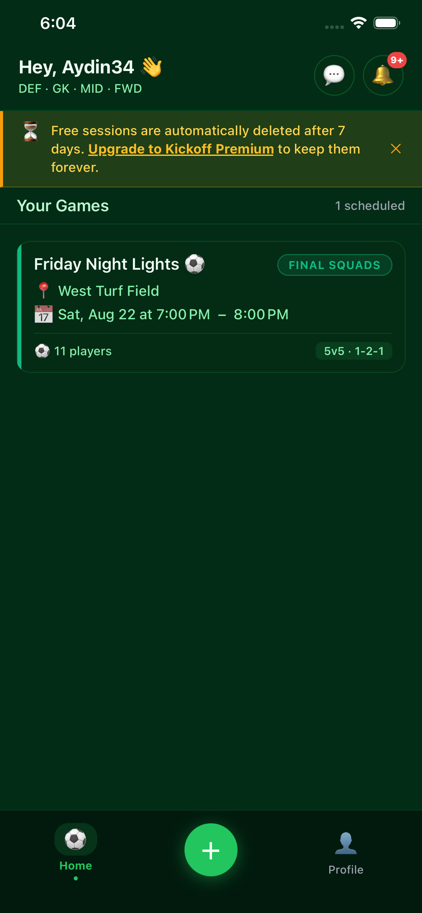
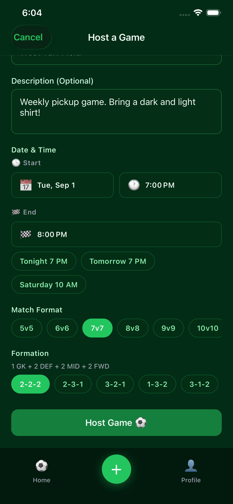
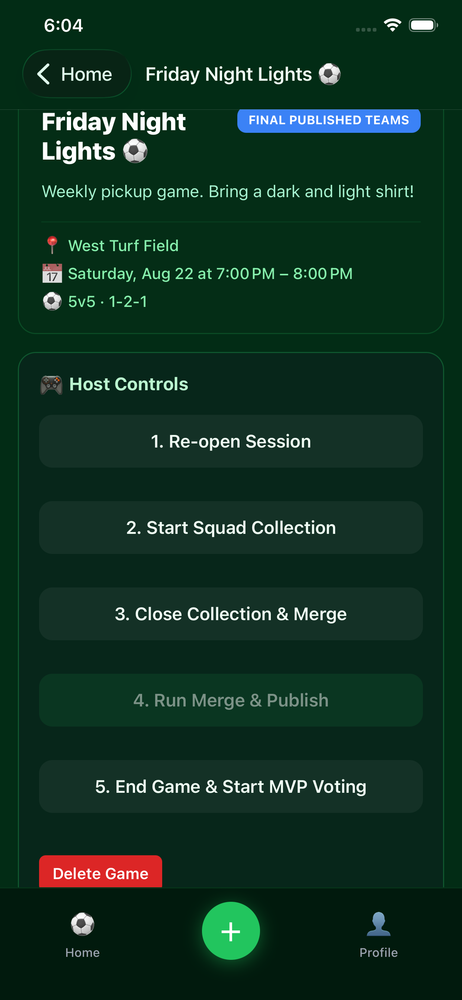
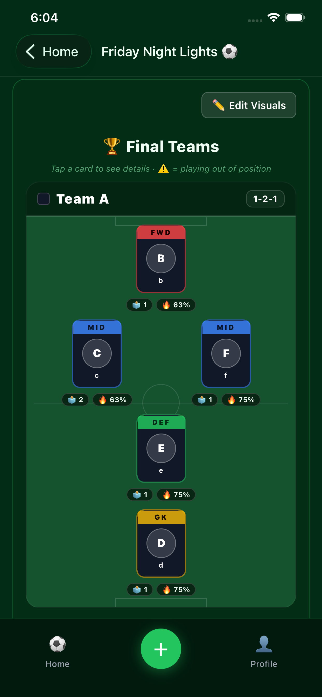
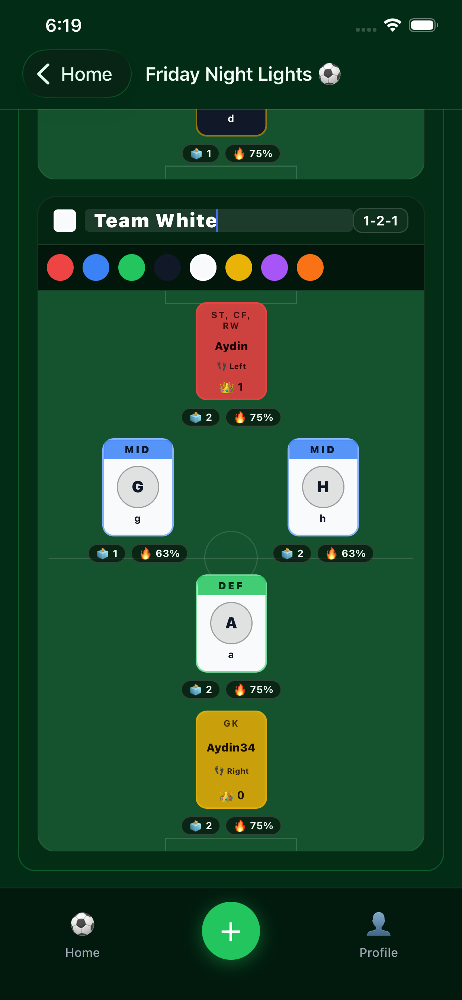
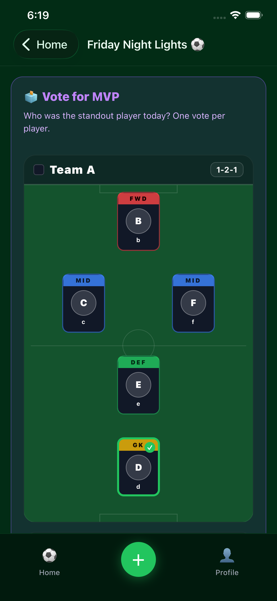
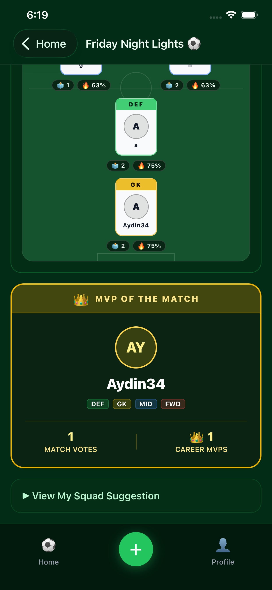
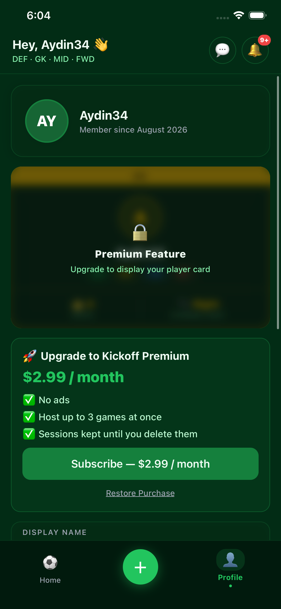

# App Screenshots - Kickoff

Explore the dark-mode user interface and tactical capabilities of **Kickoff - Pickup Soccer**.

---

## 1. Match Dashboard & Session Management

View your upcoming pickup sessions, check RSVP status, create new games, and manage player lists in one centralized feed.

---

## 2. Interactive Tactical Pitch & Squad Builder (5v5 to 11v11)

Visualize Team A and Team B formations on a tactical field board. Arrange positions, test tactics, and submit squad suggestions.

---

## 3. Smart Squad Merge Engine

Merge crowd-sourced squad suggestions using Kickoff's deterministic algorithm to automatically produce fair, balanced matchday teams.

---

## 4. Additional Screens

| Deciding Match MVP | MVP Showcase | Profile |
|:---:|:---:|:---:|
|  |  |  |

---

[← Back to Homepage](index.md) | [Support Center](support/index.md)
